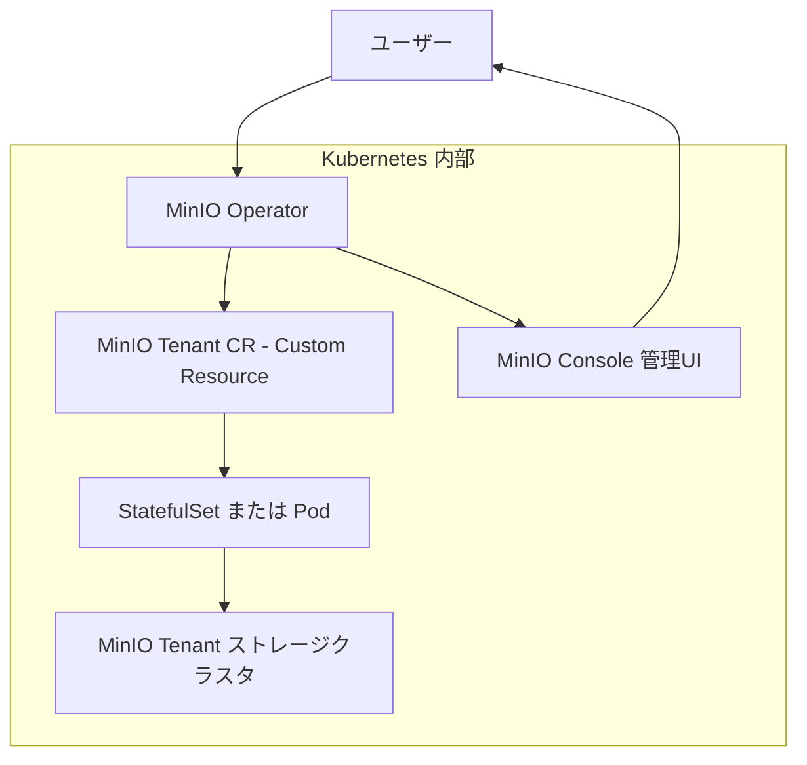

# MinIO のインストール


## 1. MinIO Operator のインストール

```sh
$ kubectl create ns minio-operator
```

### 1-1. Helm を使用したインストール

```sh
$ helm repo add minio https://operator.min.io/
$ helm repo update
```

```sh
$ helm install \
  --namespace minio-operator \
  operator minio-operator/operator
```

### 1-2. ArgoCD を使用したインストール

```sh
$ argocd app create --file apps/minio-operator.yaml
```

## 2. MinIO Tenant の作成

```sh
$ kubectl create ns minio-tenant
```

使用したい StorageClass をデフォルトに設定します。

以下は Ceph の StorageClass をデフォルトに設定する例です：

```sh
$ kubectl patch storageclass ceph-rbd \
  -p '{"metadata": {"annotations":{"storageclass.kubernetes.io/is-default-class":"true"}}}'
```

```sh
$ kubectl get sc
# Default になっていれば正常です
```

### 2-1. Helm を使用したインストール

```sh
$ helm install \
  --namespace minio-tenant \
  --values values.yaml \
  TENANT-NAME minio-operator/tenant
``` 

### 2-2. ArgoCD を使用したインストール

```sh
$ argocd app create --file apps/minio-tenant.yaml
```

## 3. MinIO Console のアクセス設定

### 3-1. ポートを開く

```sh
$ kubectl get svc -n minio-tenant myminio-console
# MinIO Console Service を特定します
# Port-Forward、NodePort、Ingress などの方法でポートを開きます
```

### 3-2. シークレットの取得

```sh
$ kubectl get secret -n minio-tenant myminio-env-configuration -o jsonpath="{.metadata.annotations}"
# 出力結果から MINIO_ROOT_USER と MINIO_ROOT_PASSWORD を確認します
```

確認した情報を使用して MinIO Console にログインします。

## Minio Operator と Minio Tenant の関係

### Mermaidでの関係図



## MinIO Operator と MinIO Tenant CR の関係

### 🔹 MinIO Operator とは？
- Kubernetes 上で MinIO クラスタ（＝Tenant）を管理する **オペレーター**
- ユーザーが作成した設定（CR）をもとに Pod や PVC を自動生成

---

### 🔹 MinIO Tenant CR とは？
- **CR（Custom Resource）** ＝Kubernetes における独自リソース定義  
- MinIO Tenant CR は「どんなMinIOクラスタを作るか」を定義するYAML  
  例：ノード数、ストレージクラス、リソース量、TLS設定など

---

## 🔗 関係性まとめ

| コンポーネント         | 役割                              |
|----------------------|---------------------------------|
| ユーザー               | Tenant CR を作成・適用             |
| MinIO Operator       | CR を監視し、MinIOクラスタを構築    |
| MinIO Tenant CR      | クラスタ構成の仕様書（YAML）       |
| StatefulSet / Pod    | 実際に動く MinIO サーバ群         |
| PVC                  | ストレージ領域（自動生成）         |
| MinIO Console        | 管理用のWeb UI（自動デプロイ）     |

---

## 🔁 処理フロー
1. ユーザーが Tenant CR を作成
2. Operator が内容を読み取り、Pod や PVC を作成
3. MinIO クラスタが起動
4. Console 経由で管理可能

