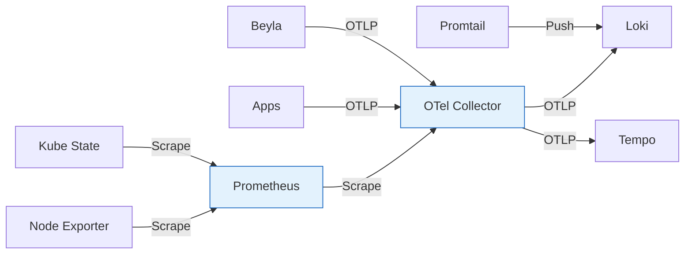
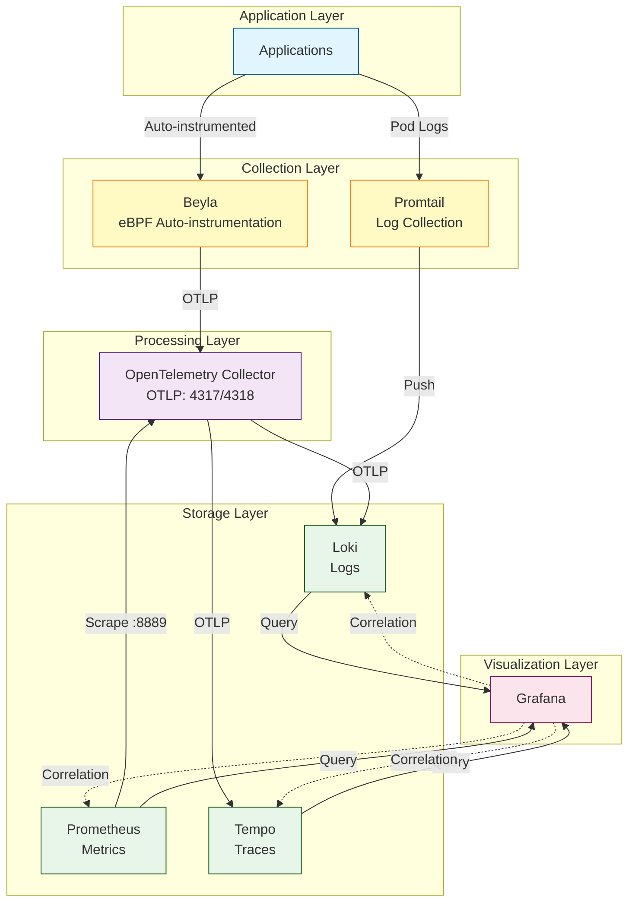
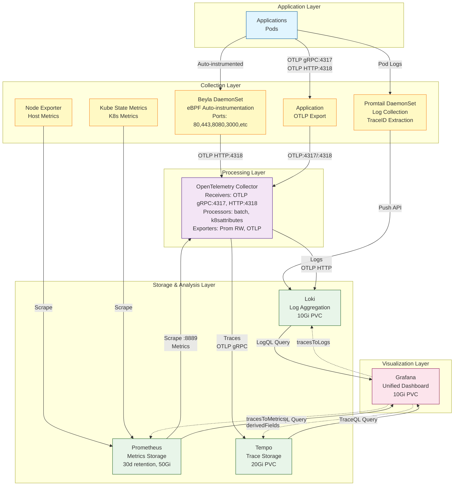

# Observability Abstract

## 概要

このディレクトリは、Kubernetes クラスターの監視・可観測性基盤を提供します。OpenTelemetry をベースとした統合観測基盤として、メトリクス、ログ、トレースの3つのテレメトリーデータを収集・分析・可視化します。



### 主要コンポーネント

- **Prometheus Stack**: メトリクス収集・保存・アラート
- **Grafana**: データ可視化とダッシュボード
- **Loki**: ログ集約とクエリ
- **Tempo**: 分散トレーシング
- **OpenTelemetry Collector**: テレメトリーデータの統一的な収集・処理・ルーティング
- **Beyla**: eBPF ベースの自動計装によるアプリケーション監視
- **Promtail**: Kubernetes Pod ログの収集・Loki への転送

### アーキテクチャの特徴

1. **自動計装**: Beyla が eBPF を使用してアプリケーションコードの変更なしにメトリクスとトレースを自動収集
2. **統合パイプライン**: OpenTelemetry Collector を中心に全てのテレメトリーデータを処理
3. **相関分析**: Grafana で Traces → Logs → Metrics の相互リンクが可能
4. **ArgoCD 管理**: 全コンポーネントが GitOps により宣言的に管理

## ディレクトリ構成

```
observability/
├── namespace.yaml                    # observability namespace定義
├── README.md                         # デプロイ手順
├── ABSTRACT.md                       # 本ドキュメント
│
├── prometheus-stack/                 # Prometheusエコシステム
│   ├── prometheus-stack.app.yaml    # ArgoCD Application (Helm)
│   └── prometheus-stack-ingress.yaml # Grafana Ingress設定
│
├── grafana/                          # Grafana設定
│   ├── datasources.yaml             # Tempo/Loki データソース定義
│   ├── dashboard-configmap.yaml     # ダッシュボード設定
│   └── dashboards/
│       └── observability-dashboard.json  # 統合ダッシュボード
│
├── loki/                            # ログ集約
│   └── loki.app.yaml                # ArgoCD Application (Helm)
│
├── promtail/                        # ログ収集エージェント
│   ├── promtail.app.yaml            # ArgoCD Application (Helm)
│   └── README.md                    # 設定ドキュメント
│
├── tempo/                           # 分散トレーシング
│   └── tempo.app.yaml               # ArgoCD Application (Helm)
│
├── opentelemetry/                   # OpenTelemetryオペレーター
│   ├── otel-operator.app.yaml       # Operatorデプロイ
│   └── otel-collector.app.yaml      # Collectorデプロイ
│
├── otel-collector/                  # OTel Collector設定
│   └── collector.yaml               # OpenTelemetryCollector CR
│
└── beyla/                           # eBPF自動計装
    ├── beyla.app.yaml               # ArgoCD Application
    └── beyla-resources.yaml         # DaemonSet, RBAC設定
```

## アーキテクチャ図

### データフロー概要



### 全体構成図



### コンポーネント詳細図

```mermaid
graph LR
    subgraph "Beyla - eBPF Auto-Instrumentation"
        BEYLA_DS[DaemonSet<br/>hostPID/hostNetwork]
        BEYLA_DS -->|Monitor Ports| PORTS[80,443,8080<br/>3000,5432,6379,9090]
        BEYLA_DS -->|Collect| METRICS_T[HTTP/gRPC Metrics<br/>Network Metrics]
        BEYLA_DS -->|Collect| TRACES_T[HTTP/gRPC Traces]
    end
    
    subgraph "OpenTelemetry Collector"
        RECEIVERS[Receivers<br/>OTLP gRPC:4317<br/>OTLP HTTP:4318<br/>Prometheus Scrape<br/>excl: kube-router]
        PROCESSORS[Processors<br/>batch<br/>k8sattributes<br/>memory_limiter]
        EXPORTERS[Exporters<br/>Prometheus :8889<br/>OTLP Tempo<br/>OTLP HTTP Loki]
        
        RECEIVERS --> PROCESSORS
        PROCESSORS --> EXPORTERS
    end
    
    subgraph "Prometheus Stack"
        PROM_SERVER[Prometheus Server<br/>30d retention<br/>50Gi storage]
        NODE_EXPORTER[Node Exporter<br/>Host Metrics]
        KUBE_STATE[Kube State Metrics<br/>K8s Object Metrics]
        
        PROM_SERVER -->|Scrape| NODE_EXPORTER
        PROM_SERVER -->|Scrape| KUBE_STATE
    end
    
    subgraph "Promtail"
        PROMTAIL_DS[DaemonSet<br/>Log Collection Agent]
        PROMTAIL_DS -->|Read| LOG_PATH[/var/log/pods<br/>/var/lib/docker/containers]
        PROMTAIL_DS -->|Pipeline| STAGES[docker parse<br/>TraceID extract<br/>K8s labels]
    end
    
    subgraph "Loki"
        LOKI_SINGLE[Single Binary Mode<br/>Filesystem Storage<br/>10Gi PVC]
    end
    
    subgraph "Tempo"
        TEMPO_SERVER[Tempo<br/>Local Storage<br/>10Gi PVC<br/>OTLP/Jaeger Receivers]
    end
    
    subgraph "Grafana"
        GRAFANA_SERVER[Grafana Server<br/>10Gi PVC]
        DS_PROM[DataSource: Prometheus]
        DS_LOKI[DataSource: Loki]
        DS_TEMPO[DataSource: Tempo]
        
        GRAFANA_SERVER --> DS_PROM
        GRAFANA_SERVER --> DS_LOKI
        GRAFANA_SERVER --> DS_TEMPO
        
        DS_TEMPO -.->|tracesToLogs| DS_LOKI
        DS_TEMPO -.->|tracesToMetrics| DS_PROM
        DS_LOKI -.->|derivedFields| DS_TEMPO
    end
    
    BEYLA_DS -->|OTLP HTTP| RECEIVERS
    PROMTAIL_DS -->|Push API| LOKI_SINGLE
    PROM_SERVER -->|Scrape :8889| EXPORTERS
    EXPORTERS -->|OTLP HTTP| LOKI_SINGLE
    EXPORTERS -->|OTLP gRPC| TEMPO_SERVER
    
    PROM_SERVER -->|Query| GRAFANA_SERVER
    LOKI_SINGLE -->|Query| GRAFANA_SERVER
    TEMPO_SERVER -->|Query| GRAFANA_SERVER

    classDef beyla fill:#fff9c4,stroke:#f57f17
    classDef promtail fill:#ffe0b2,stroke:#e65100
    classDef otel fill:#f3e5f5,stroke:#4a148c
    classDef storage fill:#e8f5e9,stroke:#1b5e20
    classDef grafana fill:#fce4ec,stroke:#880e4f
    
    class BEYLA_DS,PORTS,METRICS_T,TRACES_T beyla
    class PROMTAIL_DS,LOG_PATH,STAGES promtail
    class RECEIVERS,PROCESSORS,EXPORTERS otel
    class PROM_SERVER,NODE_EXPORTER,KUBE_STATE,LOKI_SINGLE,TEMPO_SERVER storage
    class GRAFANA_SERVER,DS_PROM,DS_LOKI,DS_TEMPO grafana
```

## デプロイメント構成

### デプロイ順序

1. **Namespace作成**
   ```bash
   kubectl apply -f observability/namespace.yaml
   ```

2. **Phase 1: 基盤コンポーネント**
   - OpenTelemetry Operator
   - Prometheus Stack (Prometheus + Grafana + Node Exporter + Kube State Metrics)
   - Loki
   - Tempo

3. **Phase 2: データ収集**
   - OpenTelemetry Collector
   - Grafana DataSources設定

4. **Phase 3: 自動計装**
   - Beyla DaemonSet

### リソース要件

| コンポーネント      | CPU Request | Memory Request | Storage  |
| ------------------- | ----------- | -------------- | -------- |
| Prometheus          | 500m        | 2Gi            | 50Gi PVC |
| Grafana             | 100m        | 128Mi          | 10Gi PVC |
| Loki                | 100m        | 256Mi          | 10Gi PVC |
| Tempo               | 100m        | 256Mi          | 20Gi PVC |
| OTel Collector      | -           | -              | -        |
| Beyla (per node)    | 100m        | 128Mi          | -        |
| Promtail (per node) | 100m        | 128Mi          | -        |

## データ相関機能

### Traces → Logs
- Tempo から trace_id を使用して対応するログを Loki で検索
- Grafana の Explore で自動リンク

### Traces → Metrics
- Tempo のスパン情報から RED メトリクス (Rate, Errors, Duration) を生成
- Service Map によるサービス間依存関係の可視化

### Logs → Traces
- Loki のログに含まれる trace_id を正規表現で抽出
- 該当トレースへの直接リンク

## 主要機能

### Beyla eBPF Auto-Instrumentation
- **対象ポート**: 80, 443, 8080, 3000, 5432, 6379, 9090
- **収集データ**:
  - HTTP/gRPC リクエストのメトリクス（レイテンシ、スループット）
  - ネットワークメトリクス
  - 分散トレース（always_on サンプリング）
  - Kubernetes メタデータの自動付与

### OpenTelemetry Collector
- **Receivers**: 
  - OTLP (gRPC/HTTP)
  - Prometheus Scrape（kube-routerを除外して重複を防止）
- **Processors**: 
  - `batch`: バッチ処理による効率化
  - `k8sattributes`: Kubernetes メタデータ付与
  - `memory_limiter`: メモリ制限（512MiB）
  - `resourcedetection`: リソース情報検出
- **Exporters**:
  - Prometheus Exporter（ポート8889でメトリクスを公開）
  - Tempo OTLP
  - Loki OTLP HTTP

### Prometheus Stack
- **Retention**: 30日
- **OTel Collector統合**: ServiceMonitor経由でOTel Collectorのメトリクスをスクレイプ（ポート8889）
- **Node Exporter**: ホストレベルのシステムメトリクス
- **Kube State Metrics**: Kubernetesオブジェクトのメトリクス

### Grafana統合
- **データソース連携**: Prometheus, Loki, Tempo
- **サイドカー設定**: ConfigMapベースの自動データソース/ダッシュボード読み込み
- **Correlation機能**: トレース・ログ・メトリクス間の相互リンク

## 管理方法

### ArgoCD GitOps
全てのコンポーネントは ArgoCD Application として管理され、Git リポジトリを信頼できる唯一の情報源 (Single Source of Truth) として使用します。

- **自動同期**: enabled (prune + selfHeal)
- **ブランチ**: `add-otel` (開発中) → `main` (本番)
- **Namespace**: `observability` (Beyla, OTel Collector, Loki, Tempo, Prometheus Stack)
- **Operator Namespace**: `opentelemetry-operator-system` (OTel Operator)

### モニタリング対象
- Kubernetes クラスター全体のメトリクス
- 全 Namespace のアプリケーション（Beyla による自動計装）
- システムレベルのリソース使用状況
- ネットワークトラフィック
